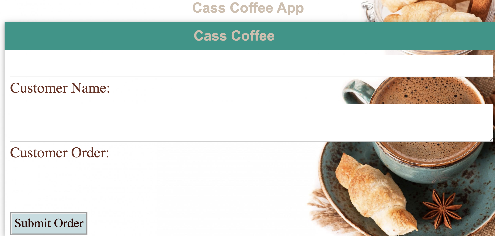

## Cass Coffee
Welcome to Cass Coffee! We are so proud of our progress and have seen amazing customer feedback. Traffic is starting to pick up and we needed a way to handle our order volume so that our orders wouldn't drop. That's why Cass Coffee was created.

This app enables the cashier to enter the customer's name and their order. Then add that order to a queue that the baristas can see and give them the ability to mark an order complete. Completed orders show which barista completed the order and have their own list. 

When the customer's order is complete, they can listen for their name as the app will announce their name and order as completed. 

## Technologies Used
HTML

CSS

Javascript

Node.js

express

mongodb

ejs

mongoose

body-parser

## Installation
1. Clone repo
2. run `npm install`

## Usage
1. run `node server.js`or `npm run start`
2. Navigate to`localhost:8080`
